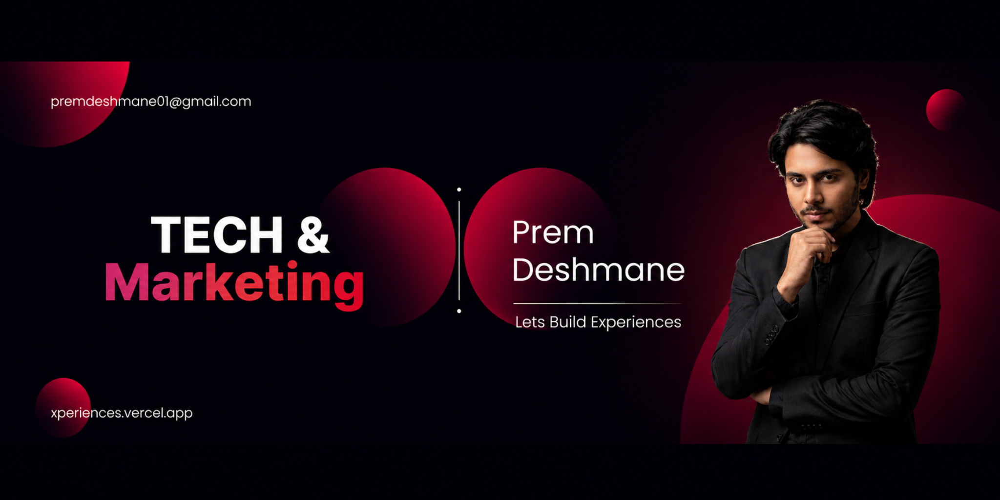

<div align="center">
  
</div>

<br/>

<div align="center">

[](https://git.io/typing-svg)

<br/>

[](https://www.linkedin.com/in/prem-deshmane01)
[](https://xperiences.vercel.app)
[](mailto:premdeshmane01@gmail.com)
[](https://instagram.com/prem.rjain)

[](https://github.com/premdeshmane-01)
[](https://github.com/premdeshmane-01)

</div>

---

## About Me

```yaml
Name        : Prem Deshmane
Role        : Engineering Student & Software Developer
Location    : Maharashtra, India
Focus       : Artificial Intelligence  •  Full-Stack Development  •  Open Source
Status      : Actively contributing to open source — available for internships and collabs
Portfolio   : xperiences.vercel.app
```

I am a software engineering student with a focus on AI-integrated development and full-stack web applications. I contribute actively to open source, build tools with practical utility, and create technical content that helps students enter the developer ecosystem. My work sits at the intersection of technology and community — I care about building things that are both well-engineered and genuinely useful.

---

## Current Focus

<table>
<tr>
<td width="50%">

**Active Work**
- Contributing to open source projects via **GSSoC 2026**
- Developing an **Indian Sign Language Recognition** system using MediaPipe and TensorFlow
- Deepening expertise in **React, MongoDB, and Machine Learning**
- Creating educational tech content for students on LinkedIn

</td>
<td width="50%">

**2025–26 Goals**
- Deliver consistent, high-quality open source contributions
- Ship full-stack projects with measurable real-world impact
- Build a strong professional presence in developer communities
- Secure an internship in software engineering or AI development

</td>
</tr>
</table>

---

## Tech Stack

**Languages**

<div align="center">
  
</div>

<br/>

**Frontend & Mobile**

<div align="center">
  
</div>

<br/>

**Backend, Databases & Cloud**

<div align="center">
  
</div>

<br/>

**AI & Machine Learning**

<div align="center">


</div>

<br/>

**Tools & Platforms**

<div align="center">
  
</div>

---

## Open Source

<div align="center">

[](https://gssoc.girlscript.tech/)

</div>

<br/>

| Contribution Area | Details |
|---|---|
| **UI/UX Fixes** | Responsive layouts, theme toggle bugs, cross-browser compatibility |
| **JavaScript** | Dropdown interactions, event handling, functionality enhancements |
| **Documentation** | README improvements, contribution guides, onboarding docs |
| **Feature Development** | Beginner-friendly issue resolution, minor feature additions |

I prioritize contribution quality over volume. Every pull request I submit is reviewed thoroughly and designed to leave the codebase better than I found it.

---

## GitHub Stats

<div align="center">


&nbsp;


<br/><br/>


<br/><br/>


</div>

---

## Achievements

<div align="center">
  
</div>

---

## A Few Things Worth Knowing

```
• I train six days a week — the same discipline carries into my development work.
• I'm building a real-time Indian Sign Language recognition system as a hackathon project.
• I create technical content on LinkedIn focused on open source, AI tools, and student growth.
• My best work happens when the problem is real and the deadline is real.
• I believe clean code and clean UI are equally non-negotiable.
```

---

## Dev Quote of the Day

<div align="center">
  
</div>

---

<div align="center">

*Open to internships, open source collaborations, and meaningful technical conversations.*

<br/>

[](https://www.linkedin.com/in/prem-deshmane01)
[](https://xperiences.vercel.app)
[](mailto:premdeshmane01@gmail.com)

</div>

---

<div align="center">
  <sub>Built with intention. Updated consistently.</sub>
</div>
